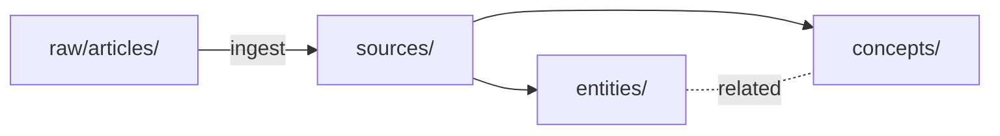

# Skill: Query

Answer a question from the wiki, not from scratch.

## Preconditions

- The user has asked a substantive question about content.
- `wiki/index.md` exists (it always should).

## Recipe

### 1. Read `wiki/index.md`

This is always step 1. Identify which Sources / Entities / Concepts pages are relevant.

### 1.5. (twin-layer-brain) Optionally shortlist with Layer 1

This brain has an SQLite search layer (FTS5 + embeddings). If the question is
narrow or the index is large, use MCP / `kc search` to shortlist candidate
pages **before** reading the wiki:

- `search_notes` (FTS5) — fast keyword match
- `search_similar_notes` (embedding) — semantic near-neighbours (needs API key)

The shortlist is a **hint**. The actual reading, citation, and synthesis still
happen via `wiki/index.md` → relevant pages → `[[wiki-link]]` traversal. Never
synthesize from raw SQL hits alone — that loses compound.

### 2. Read relevant pages (not raw/)

Pull in the pages from step 1. Follow their `[[wiki-links]]` to related pages if needed.

**Only consult `raw/` when:**

- The wiki is silent on a topic the user expects answered.
- The wiki looks stale or contradicts itself and needs a source check.

For **deep implementation-level reads of `raw/repos/<repo>/`** (trace a function, inspect recent commits, verify behaviour at the code level), use the `dive` skill instead. Query consults `raw/` only to fill small gaps; anything deeper belongs to dive's exception lane.

### 3. Synthesize with citations

Every non-trivial claim cites the wiki page it came from:

- "According to [[concepts/llm-wiki-pattern]], the crux is persistence."
- "Both [[entities/foam]] and [[entities/obsidian]] support wiki-links, but they differ in graph view behavior."

The wiki page, in turn, cites `[[sources/...]]`.

### 4. Pick a response format that fits

| Question shape | Format |
|---|---|
| "What is X?" | Prose with citations |
| "How does X differ from Y?" | Comparison table |
| "How does X relate to Y?" | Mermaid graph / sequence |
| "When should I use X vs Y?" | Decision tree (bulleted) |
| "Walk me through X" | Marp slide outline |
| "Give me an analysis of X" | New markdown page |

Mermaid and Marp render inline in VS Code preview.

### 5. Offer to save the answer

If the answer has lasting value (newly-noticed connection, comparison, analysis), propose one of:

- **Analysis (fast):** `wiki/analyses/YYYY-MM-DD-<slug>.md`. Gitignored by default (see `.gitignore`). Snapshot — will go stale.
- **Canonical (slow, durable):** update / create the best-fit page — `wiki/topics/<slug>.md` (cross-cutting thesis), `wiki/concepts/<slug>.md` (abstract pattern), or `wiki/entities/<slug>.md` (concrete thing). Update `wiki/index.md`. Goes into git.

Ask the user which. Default to analysis if they just want to "keep this somewhere". If the answer is a cross-cutting synthesis that will be re-read often, suggest running `sublime` right after to route it through a topic page.

### 6. Append to `wiki/log.md`

```markdown
## [YYYY-MM-DD] query | <question short form>

- Read: [[index]], [[concepts/<slug>]], [[entities/<slug>]]
- Format: <prose | table | mermaid | decision-tree | marp | new-page>
- Outcome: <answered in chat | filed as [[analyses/<slug>]] | promoted to [[concepts/<slug>]]>
```

## Format examples

### Comparison table

```markdown
| 観点 | Foam | Obsidian |
|---|---|---|
| 実体 | VS Code 拡張 | スタンドアロンアプリ |
| graph view | サイドバー | 専用タブ |
| ... | ... | ... |
```

### Mermaid diagram

````markdown

````

### Decision tree

```markdown
- Q: Foam vs Obsidian?
  - 主用途が VS Code の他用途と混ざる（コード・設定）? → **Foam**
  - graph view の豊富な表示オプションが欲しい? → **Obsidian**
  - ...
```

## Anti-patterns

- ❌ Going to `raw/` before reading the wiki.
- ❌ Answering without citations.
- ❌ Writing prose when the question is clearly "compare X and Y".
- ❌ Silently promoting an analysis to canonical without asking.
- ❌ Forgetting to append to `log.md`.

## Done

If filed as analysis/canonical, confirm to the user:

- Where it's saved.
- What was updated in `index.md`.
- The log entry.

## Reference

- 詳細方針: `references/karpathy-llm-wiki.md`
